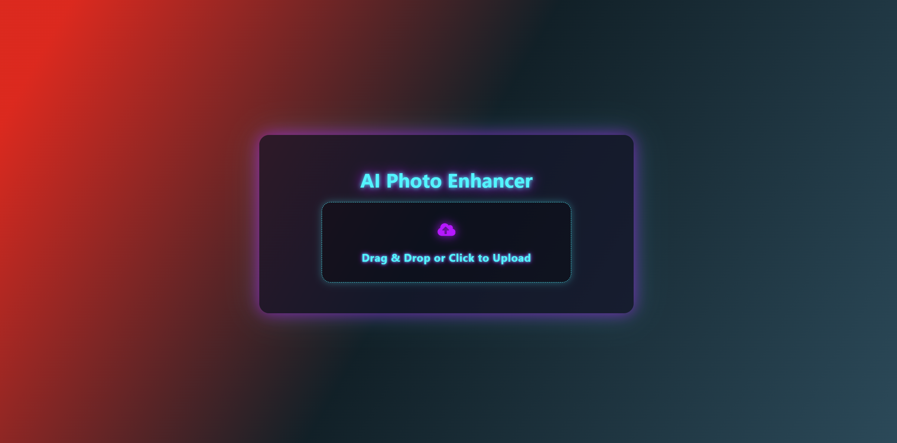
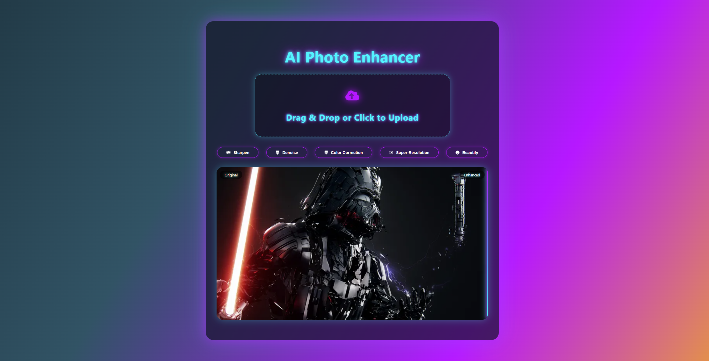

# AI Photo Enhancer (Remini‑style)

An end‑to‑end photo enhancement app with a modern neon UI and a C++/OpenCV backend. The frontend provides a Remini.ai–style experience with a before/after slider, enhancement options, and a polished neon theme. The backend uses OpenCV to apply sharpening, denoising, color correction (CLAHE), super‑resolution (resize), and optional beautify (face smoothing) with face detection.






## Features
- Neon, diagonal gradient background with frosted‑glass container
- Centered, glowing heading: “AI Photo Enhancer”
- Drag‑and‑drop image upload with preview
- Before/after slider (wipe effect: original left, enhanced right)
- Enhancement options (pick, then apply):
  - Sharpen
  - Denoise (fastNlMeansDenoisingColored with smart downscale)
  - Color Correction (CLAHE in Lab)
  - Super‑Resolution (high‑quality resize)
  - Beautify (face detection + skin smoothing)
- Download single enhanced image with chosen output format
- Output format selector near Download: PNG (lossless) or JPEG (quality slider)
- Options reset when a new photo is chosen
- Logs in backend for each enhancement step

## Repository Structure
```
Photo_Enhancer/
  CMakeLists.txt
  Photo_Enhancer.cpp
  Photo_Enhancer.h
  Crow/              # Crow framework headers (embedded)
  Asio/              # Asio headers (embedded)
  frontend/
    package.json
    package-lock.json
    public/
      index.html
    src/
      App.js
      index.js
      UploadPage.jsx
      style.css
    build/           # Generated by `npm run build` (ignored in VCS)
  out/               # CMake/Ninja build tree (ignored in VCS)
  uploads/           # Runtime uploads/outputs (ignored in VCS)
  .vscode/
    launch.json      # Debug configurations (frontend + backend)
```

## Tech Stack
- Frontend: React (Hooks), react‑select, CSS neon theme
- Backend: C++20, Crow (HTTP server), OpenCV (image processing), Asio
- Build: CMake, Ninja or Visual Studio/MSBuild
- Parallelism: OpenCV with oneTBB (optional, via DLLs on Windows)

## Frontend
### Prerequisites
- Node.js 18+

### Install and Run (development)
```bash
cd frontend
npm install
npm start
```
This launches the React dev server at `http://localhost:3000`.

### Build (production)
```bash
cd frontend
npm run build
```
Build output lands in `frontend/build/`.

### Key UI/UX Details
- Titles/headings centered; neon glow (`.glow-text`)
- Animated diagonal gradient background with red → yellow → deep purple → cyan
- Frosted glass container with soft glow
- Before/after comparison uses a draggable slider controlling a CSS clip‑path
- Enhancement options hidden until an image is chosen; laid out in a single row
- Output format (react‑select) aligned with Download; JPEG quality slider appears when JPEG is selected

## Backend (C++)
### Prerequisites (Windows)
- Visual Studio Build Tools (or full VS) with C++ toolset
- CMake 3.26+
- Ninja (optional) or use the Visual Studio generator
- OpenCV installed (e.g., `C:/OpenCV`)
  - Ensure `OpenCV_DIR` in `CMakeLists.txt` points to your OpenCV cmake dir (e.g., `C:/OpenCV/opencv/build/x64/vc16/lib`)
- oneTBB DLLs (optional for OpenCV parallelism): `tbb12.dll`, `tbbmalloc.dll`

### Configure and Build (Ninja)
```powershell
# from repo root
mkdir out/build/x64-debug
cd out/build/x64-debug
cmake ../../.. -G "Ninja" -A x64
cmake --build . -j
```
This produces `Photo_Enhancer.exe` under `out/build/x64-debug/`.

### Configure and Build (Visual Studio generator)
```powershell
mkdir out/build/x64-debug
cd out/build/x64-debug
cmake ../../.. -G "Visual Studio 17 2022" -A x64
cmake --build . --config Debug
```

### Run
```powershell
# From repo root
out/build/x64-debug/Photo_Enhancer.exe
```
The server starts and listens on the configured port (see code). Ensure the `uploads/` directory exists (backend will create/use it under the working directory).

### TBB/oneTBB Parallelism on Windows (optional)
OpenCV can leverage oneTBB for better parallelism. Place `tbb12.dll` and `tbbmalloc.dll` next to your executable so they can be found at runtime:
- Copy both DLLs to the same directory as `Photo_Enhancer.exe` (e.g., `out/build/x64-debug/`).
- Restart the executable. Check logs: OpenCV should stop printing TBB load failures.

### API Overview
- POST `/api/enhance`
  - multipart form‑data: `file` (image)
  - JSON fields (can be sent in a separate field or as request body depending on your client):
    - `sharpen`: boolean
    - `denoise`: boolean
    - `colorCorrection`: boolean
    - `superResolution`: boolean
    - `beautify`: boolean
    - `outputFormat`: "png" | "jpeg"
    - `jpegQuality`: number (70–100)
  - Response: `{ success: true }` on success (image is written to `uploads/processed.(png|jpg)`).

- GET `/api/processed?format=png|jpeg`
  - Returns the last processed image as attachment with correct Content‑Type and filename.

### Image Processing Pipeline (high level)
- Read input → `cv::Mat`
- Optionally `sharpen` via `filter2D`
- Optionally `denoise` via `fastNlMeansDenoisingColored`
  - Downscale large images to ≤1600px before denoise; upscale back to preserve time/quality
- Optionally `colorCorrection` via Lab + CLAHE per channel, then merge
- Optionally `superResolution` via `cv::resize` (bicubic/area as appropriate)
- Optionally `beautify` via Haar cascade face detection + `bilateralFilter` on face regions
- Save as PNG or JPEG with quality parameter

## Debugging
### VS Code Launch Configurations
Stored in `.vscode/launch.json`:
- "Launch C++ Backend" (lldb) → runs `out/build/x64-debug/Photo_Enhancer.exe`
- "Launch React Frontend" (pwa‑node) → runs `npm start` in `frontend`
- Compound: "Launch Both"

## Environment and Paths
- Adjust `OpenCV_DIR` in `CMakeLists.txt` to your installation
- Ensure OpenCV DLLs are in PATH or alongside the executable at runtime
- Place TBB DLLs next to the executable if enabling advanced parallelism

## Development Tips
- Keep `frontend/build/`, `out/`, and `uploads/` out of version control
- If React complains about multiple React versions, run `npm dedupe` inside `frontend`
- If `react-select` module not found: `cd frontend && npm install react-select`

## Troubleshooting
- npm ENOENT at repo root: run npm commands inside `frontend/`
- Downloaded image opens instead of downloading: backend must set `Content-Disposition: attachment` and correct `Content-Type`
- JPEG quality looks poor: switch to PNG or increase `jpegQuality`
- Denoise slow: verify downscaling step and consider disabling denoise for very large images
- TBB not loading: DLLs must be next to `Photo_Enhancer.exe`, not only in the OpenCV folder

## License
Choose a license and add it here (e.g., MIT).
